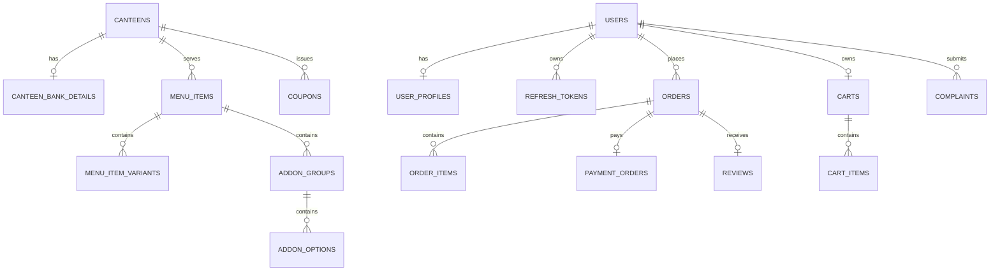
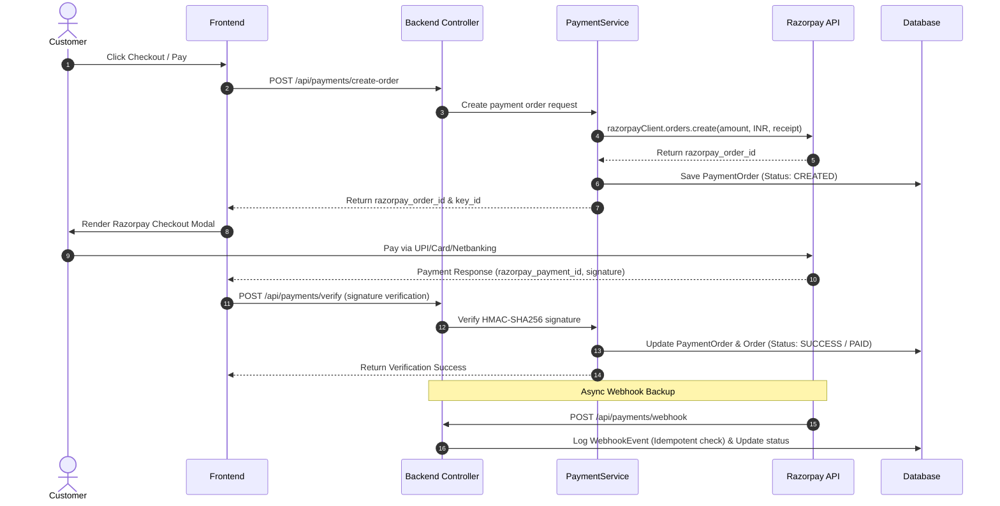

# CHARUSAT Campus Canteen Aggregator — System Architecture & Backend Documentation

## 1. System Overview

**CHARUSAT Campus Canteen Aggregator** is a multi-vendor campus dining platform designed to handle online food ordering, real-time order tracking, digital payments, coupon management, and canteen administration.

The backend is built as a **stateless, production-ready Spring Boot 3 RESTful API** backed by a **PostgreSQL** database, featuring bank-grade security protocols (AES-256-GCM payload and field-level encryption, TOTP MFA, Google OAuth2, JWT with refresh token rotation), real-time STOMP WebSockets, and Razorpay payment gateway integration.

---

## 2. Architecture Diagram

```mermaid
graph TD
    subgraph Clients
        FE[React Frontend / SPA]
        Mobile[Mobile / Web Client]
    end

    subgraph Security_Layer["Security & Gateway Layer (Spring Security)"]
        USF[UrlSanitizationFilter]
        SHF[SecurityHeadersFilter]
        PEF[PayloadEncryptionFilter (AES-256-GCM)]
        JAF[JwtAuthenticationFilter]
        RLS[RateLimiterService]
    end

    subgraph Controllers["REST Controllers Layer (/api/*)"]
        AC[AuthController & MfaController]
        CC[CanteenController & OrderController]
        CartC[CartController & PaymentController]
        CouponC[CouponController & AnalyticsController]
        RC[ReviewController & ComplaintController]
    end

    subgraph Services["Business Logic Layer (@Service)"]
        AS[AuthService / GoogleAuthService]
        OS[OrderService / CartService]
        PS[PaymentService (Razorpay)]
        CS[CouponService & CouponValidationService]
        WSS[WebSocketService (STOMP Broker)]
        ES[EmailService (Brevo API)]
        PCS[PayloadCryptoService / FieldEncryptor]
    end

    subgraph Data_Layer["Data Access & Storage Layer"]
        Repo[Spring Data Repositories]
        PG[(PostgreSQL Database)]
        STOMP[STOMP Memory Broker (/topic)]
    end

    FE -->|HTTP / JSON Encrypted| USF
    USF --> SHF --> PEF --> JAF --> RLS
    RLS --> Controllers
    Controllers --> Services
    Services --> Repo --> PG
    Services -->|Broadcast Encrypted Events| STOMP
    STOMP -->|WebSocket / SockJS| FE
    PS -->|Webhook / Verification| Razorpay[Razorpay Payment Gateway]
```

---

## 3. Technology Stack & Key Dependencies

| Component | Technology / Library | Version | Description |
|---|---|---|---|
| **Core Framework** | Java / Spring Boot | JDK 17 / 3.2.2 | Core backend framework |
| **Security Framework** | Spring Security | 6.x | Security filter chain, RBAC, method security |
| **Database** | PostgreSQL / H2 | PostgreSQL 15+ | Relational persistence with 3NF schema |
| **Data Access** | Spring Data JDBC / JDBC Template | 3.2.2 | Data repositories and raw SQL initialization |
| **Authentication** | JJWT (io.jsonwebtoken) | 0.12.3 | Stateless JWT generation and verification |
| **OAuth 2.0** | Google API Client | Google OAuth2 | Google Sign-In backend verification |
| **MFA / 2FA** | Commons Codec | 1.17.0 | HMAC-SHA1 + Base32 TOTP implementation |
| **Payment Gateway** | Razorpay Java SDK | 1.4.5 | Order creation, HMAC verification, Webhooks |
| **Real-time Comms** | Spring WebSocket + STOMP | SockJS | Real-time order updates, canteen status, coupons |
| **Email Service** | Spring Mail / Brevo HTTP API | Brevo API Key | Email verification, password reset OTPs |
| **API Docs** | SpringDoc OpenAPI | 2.3.0 | Swagger UI documentation at `/swagger-ui.html` |
| **Boilerplate Reduction** | Project Lombok | 1.18.x | Auto-generation of getters/setters/constructors |

---

## 4. Core Architecture Layers

```
com.charusat.canteen
├── config/         # Security, CORS, WebSockets, Filters, Data Initializers
├── controller/     # REST Controllers exposing endpoints
├── dto/            # Data Transfer Objects (Requests, Responses, Enums)
├── exception/      # Custom Exception handlers & Global Exception Handler
├── model/          # Domain Entities (Mapped to PostgreSQL tables)
├── repository/     # Spring Data JDBC Repositories
├── scheduler/      # Cron tasks (Account deletion, coupon expiration)
├── service/        # Core Business Logic and Domain Services
└── util/           # Cryptographic and helper utilities (FieldEncryptor)
```

---

## 5. Security Architecture

### 5.1 Authentication Protocols
- **Local Authentication**: Password hashing using **BCrypt** with configurable cost factor.
- **Google OAuth 2.0**: Verification of Google ID Tokens; auto-provisions or links user accounts.
- **JWT Session Tokens**:
  - **Access Token**: Short-lived (15 minutes), passed via `Authorization: Bearer <token>` header.
  - **Refresh Token**: Long-lived (30 days), stored hashed in DB with IP/Device metadata and automatic token rotation.

### 5.2 Multi-Factor Authentication (TOTP MFA)
- Implements Time-based One-Time Passwords (RFC 6238) using HMAC-SHA1 and Base32 secrets.
- Full setup workflow: QR Code URI generation -> Secret Encryption -> Verification -> Enforcement at login.
- Audit logged in `mfa_events` table.

### 5.3 Password & Lockout Policy (NIST 800-63B)
- Password length: 8–128 characters with uppercase, lowercase, and digit requirements.
- Password history check: Prevents re-use of last 5 passwords.
- Account Lockout: 5 failed login attempts in 15 minutes triggers a 5-minute lockout.

### 5.4 Double-Layer Encryption
1. **Payload Encryption (Application Layer)**:
   - `PayloadEncryptionFilter` & `PayloadCryptoService`: Intercepts JSON requests/responses and encrypts/decrypts using **AES-256-GCM**.
   - Defeats Wireshark / Burp Suite inspection even under HTTPS MITM.
2. **Database Field Encryption (Data at Rest)**:
   - `FieldEncryptor`: Encrypts sensitive DB columns (e.g. mobile numbers, MFA secrets, bank account numbers) using AES-256-GCM with unique 12-byte random IVs per operation.

---

## 6. Database Schema & Data Model (3NF Normalized)

The PostgreSQL database comprises **30 tables** normalized to 3rd Normal Form:



### Table Summary
1. `users` & `user_profiles`: User identity, RBAC (`USER`, `VENDOR`, `ADMIN`), and contact info.
2. `canteens` & `canteen_bank_details`: Canteen operational parameters and payout information.
3. `categories`, `menu_items`, `menu_item_tags`, `menu_item_variants`, `addon_groups`, `addon_options`: Menu hierarchy.
4. `coupons`, `coupon_applicability`, `coupon_usage`, `coupon_analytics`: Advanced discount engine tables.
5. `carts`, `cart_items`: Real-time user shopping cart persistence.
6. `orders`, `order_items`: Order records and itemized snapshots.
7. `payment_orders`, `webhook_events`: Razorpay payment integration and webhook idempotency.
8. `reviews`, `complaints`, `favorites`: User feedback, disputes, and bookmarking.
9. `login_attempts`, `password_history`, `password_reset_tokens`, `refresh_tokens`, `mfa_events`: Security and audit logging.

---

## 7. Real-Time Communication (WebSocket & STOMP)

WebSockets are enabled via Spring STOMP broker at `/ws`. Payloads broadcast over STOMP are AES-256-GCM encrypted.

### Subscribed Topics
- `/topic/orders`: Global feed of new incoming orders.
- `/topic/restaurant/{canteenId}`: Per-canteen incoming orders feed for vendor dashboards.
- `/topic/order-updates`: Global order status changes.
- `/topic/customer/{customerId}`: Targeted order status updates for customer UI.
- `/topic/canteens` & `/topic/canteen/{id}/status`: Real-time open/closed canteen toggles.
- `/topic/coupons` & `/topic/coupons/{canteenId}`: Real-time coupon creation, update, and deletion broadcasts.

---

## 8. Payment Processing Pipeline (Razorpay)



---

## 9. API Endpoint Reference

### Authentication (`/api/auth`)
- `POST /api/auth/register` — User registration
- `POST /api/auth/login` — Email/password login with MFA check & lockout
- `POST /api/auth/google` — Google OAuth2 token verification & login
- `POST /api/auth/refresh-token` — Refresh access token
- `POST /api/auth/logout` — Revoke refresh token & clear session
- `GET  /api/auth/verify-email` — Verify email via token

### MFA / 2FA (`/api/mfa`)
- `POST /api/mfa/setup` — Generate TOTP secret & QR code URI
- `POST /api/mfa/enable` — Enable MFA after verifying code
- `POST /api/mfa/disable` — Disable MFA
- `POST /api/mfa/validate` — Validate 6-digit MFA code during login

### Canteens & Menu (`/api/canteens`, `/api/menu`)
- `GET  /api/canteens` — List all canteens
- `GET  /api/canteens/{id}` — Get canteen details
- `PUT  /api/canteens/{id}/status` — Toggle open/closed status (Vendor/Admin)
- `GET  /api/menu/canteen/{canteenId}` — Get menu items for canteen

### Cart & Orders (`/api/cart`, `/api/orders`)
- `GET  /api/cart` — View current user cart
- `POST /api/cart/items` — Add item to cart
- `DELETE /api/cart/items/{itemId}` — Remove item from cart
- `POST /api/orders` — Place new food order
- `GET  /api/orders/my-orders` — Customer order history
- `GET  /api/orders/vendor/{canteenId}` — Vendor order queue
- `PUT  /api/orders/{id}/status` — Update order status (Vendor)

### Coupons (`/api/coupons`)
- `GET  /api/coupons` — Browse valid coupons
- `POST /api/coupons/validate` — Validate coupon against current cart
- `POST /api/coupons` — Create coupon (Vendor)
- `PUT  /api/coupons/{id}` — Edit coupon (Vendor)

### Payments & Webhook (`/api/payments`)
- `POST /api/payments/create-order` — Initiate Razorpay payment order
- `POST /api/payments/verify` — Verify Razorpay HMAC signature
- `POST /api/payments/webhook` — Public Razorpay webhook listener

---

## 10. Key Configuration Properties

Configuration is managed via `application.properties`:
- `server.port=8000`
- `spring.datasource.url=jdbc:postgresql://localhost:5432/charusatneeds`
- `jwt.secret` & `jwt.expiration=900000` (15 mins)
- `security.encryption.key` (Field AES-256-GCM key)
- `security.payload.encryption.key` (Payload AES-256-GCM key)
- `razorpay.key.id`, `razorpay.key.secret`, `razorpay.webhook.secret`
- `google.client.id`, `google.client.secret`, `google.redirect.uri`
